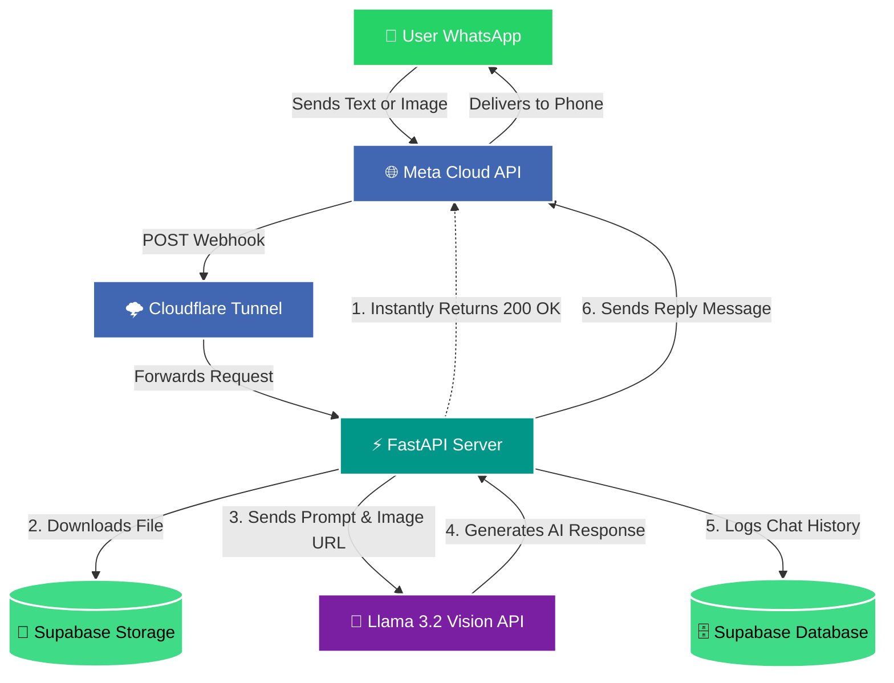

# 🎓 Voraus AI - Educaro WhatsApp Bot

Voraus AI is an intelligent WhatsApp bot designed to assist students with German university admissions, vocational training, visas, and bureaucracy. 

Powered by **Llama 3.2 11B Vision**, this bot can answer complex questions, read and extract information from documents/images (OCR), and seamlessly store all interactions and datasets in **Supabase**.

---

## 🏗️ Architecture & Flowchart

The bot is built using FastAPI and runs in real-time, utilizing Background Tasks to instantly acknowledge WhatsApp messages preventing Meta from timing out the connection.



---

## ✨ Key Features
* **Multi-Modal AI:** Can read both standard text messages and images (PDFs/JPGs) using NVIDIA's Llama 3.2 API.
* **Instant Acknowledgment:** Uses FastAPI `BackgroundTasks` to prevent Meta's strict 3-second webhook timeouts.
* **Cloud Storage:** Automatically downloads WhatsApp images and uploads them to a public Supabase bucket.
* **Automated Data Injection:** Includes a highly optimized script (`upload_datasets.py`) to flawlessly inject dozens of CSV datasets directly into Supabase's PostgreSQL core.

---

## 🛠️ Setup Instructions

### 1. Install Dependencies
Make sure you have Python installed, then run:
```bash
pip install -r requirements.txt
```
*(Dependencies include: `fastapi`, `uvicorn`, `requests`, `supabase`, `openai`, `pandas`, `sqlalchemy`, `psycopg2-binary`)*

### 2. Environment Variables
Create a `.env` file in the root directory and add the following keys:
```env
WHATSAPP_TOKEN=your_meta_temporary_or_permanent_token
VERIFY_TOKEN=voraus_ai_verify_token_123
SUPABASE_URL=https://your-project.supabase.co
SUPABASE_KEY=your_anon_public_key
LLAMA_API_KEY=nvapi-your-nvidia-api-key
```

### 3. Supabase Configuration
You need two things set up in your Supabase project:
1. **Database Table:** A table named `chat_history` with columns `user_phone`, `user_message`, and `ai_response`.
2. **Storage Bucket:** A bucket named exactly `chat_media`. **It must be set to PUBLIC** so the AI can read the images.

---

## 🚀 How to Run the Bot

You will need **two terminal windows** open at the same time.

**Terminal 1: Start the Python Server**
```bash
python -m uvicorn main:app --reload
```

**Terminal 2: Start the Cloudflare Tunnel**
```bash
.\cloudflared.exe tunnel --url http://localhost:8000
```
*Copy the `https://...trycloudflare.com` URL that Cloudflare generates. Go to your Meta Developer Dashboard, edit your WhatsApp Webhook, paste the URL (add `/whatsapp` to the end of it), and verify using the token `voraus_ai_verify_token_123`.*

---

## 📁 How to Upload Datasets
If you have new CSV datasets (like Course Guides, Visas, etc.), put them in the `educaro datasets` folder. 

1. Open `upload_datasets.py`.
2. Update line 10 with your direct Supabase Database Password.
3. Run the script:
```bash
python upload_datasets.py
```
This script bypasses the buggy Supabase Dashboard CSV uploader and builds perfectly typed database tables automatically!